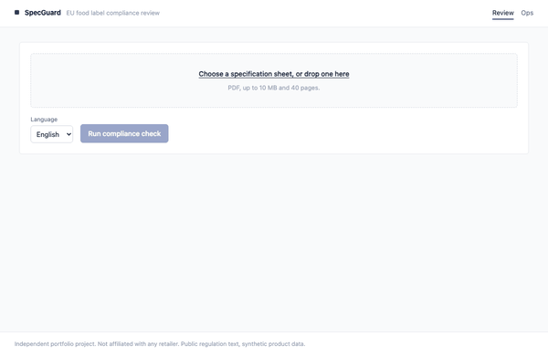

# SpecGuard

A supplier's food specification sheet goes in as a PDF. A per-rule **PASS / FAIL /
NEEDS_REVIEW** report comes out, and every verdict names the article of EU food law it
rests on, quoting the words it relied on. It is built for the person who has to sign off a
private-label product before it ships and who currently does that by reading a PDF against
a regulation in another tab.



*Recorded against the running stack: upload, poll, verdicts grouped by severity, then the
clause the failing verdict rests on with the quoted words marked inside it.*

## What this is and isn't

An **independent portfolio project**. Not affiliated with any retailer, and no proprietary
data of any kind is in this repository.

The knowledge base is public EUR-Lex text — Regulations (EU) 1169/2011 and (EC) 1924/2006,
English and German. The specification sheets are **synthetic**, generated by
`fixtures/specs/generate.py` in this repo, with each one's defects deliberately seeded and
recorded so they can serve as ground truth. Nothing here was derived from a real
supplier's document.

It is also not a compliance authority. It is a reviewer's assistant that shows its
working, and its most important behaviour is declining to answer when the evidence does
not support one.

## Quickstart

```bash
cp .env.example .env
docker compose --profile app up -d
docker compose exec api python -m specguard.corpus.seed
```

That is the whole thing: the UI on <http://localhost:5173>, the API on
<http://localhost:8000>, n8n on <http://localhost:5678>. The regulation text is committed,
so the seed indexes from disk and downloads nothing but the embedding model.

Docker needs **at least 4 GB** for this: the embedding model is resident in the API and the
worker, and Qdrant keeps the collection in memory. Below that the seed is killed with
SIGKILL — no traceback, just a command that stops.

Verified from a fresh `git clone` by `scripts/clean-clone-test.sh`, which clones into a
temporary directory, runs exactly those commands on non-default ports, submits a sample
specification and asserts the report comes back with citations.

Without Docker: `cd api && uv sync && uv run pytest`. The whole test suite and the tier 1
eval run offline against recorded fixtures — no API key, no services, no network.

## Architecture

```
 PDF ──► parse ──► extract ──► plan ──► check ──► verify ──► aggregate ──► report
          │           │          │        │         │
     pdfplumber   one LLM    which     8 rules   gates:
     + PII scrub  call,      rules              citation resolves,
     + injection  schema-    apply?             confidence floor,
       screen     constrained                   allergen escalation
                                  │
                      ┌───────────┴───────────┐
                      │                       │
              4 deterministic rules    4 retrieval-backed rules
              pure Python, no          Qdrant hybrid search ──► judge ──► verify
              model client at all      (dense + sparse, RRF)
```

A request: the API accepts the upload, rejects anything that is not a PDF under 10 MB
before writing it anywhere, and queues a job on Redis. The worker parses the PDF —
redacting personal data into the document itself, so no later stage can pass the
unredacted text — screens it for text addressed to the model, and makes **one**
schema-constrained call to extract a `ProductSpec` where every field carries its own
confidence and the span it was read from.

Then eight rules run. **Four never touch a model**: mandatory particulars, energy
arithmetic against the Annex XIV factors, the per-100 basis, and allergen emphasis. These
are arithmetic, set membership and string presence over a structured record; a model can
only make them slower, more expensive and less reliable. The boundary is enforced by what
each rule is handed — a deterministic rule receives a context object with no model client
in it, so it has nothing to make a call *with*.

The other four need a clause read in context: does this wording meet the conditions of use,
is origin declaration required here. Each retrieves from Qdrant, asks a judge for a
verdict, then **verifies** it: the cited chunk must have been in the retrieved set, its id
must re-derive from the clause it names, the quoted span must appear verbatim, and a second
call must agree that span supports the verdict. Anything short of all four becomes
`NEEDS_REVIEW` with a stated reason.

Full rule table and node contract: [`docs/plan.md`](docs/plan.md).

## Design decisions

Eight of the twenty entries in [`docs/decisions.md`](docs/decisions.md). Each one is a
choice that could have gone the other way.

**Deterministic rules never see a model.** Arithmetic and field presence have one correct
answer. Routing them through an LLM buys nothing and costs latency, money and
reproducibility. Enforced structurally: the context handed to a deterministic rule has no
client on it. *Cost:* two code paths to maintain instead of one, and a rule that becomes
judgement-shaped later has to move deliberately.

**`chunk_id` is a UUIDv5 over (regulation, article, paragraph, source_version).** Citations
live in Postgres, clause vectors live in Qdrant, and the two must still agree after a
re-index. Deriving the id from the clause means re-indexing reproduces it exactly, so the
id *is* the Qdrant point id and no mapping table exists to fall out of sync. *Cost:* the
namespace UUID is frozen for the life of the project, and the id is opaque where a hash
prefix would have been greppable. (001)

**Vectors are in Qdrant, not Postgres.** Hybrid dense + sparse retrieval with native RRF
fusion server-side, rather than fusing in application code over two queries. pgvector is
implemented behind the same interface and benchmarked on the same 58 golden queries:
**Qdrant 57.2% recall@5 against pgvector's 46.8%**, and pgvector about 23 ms faster at p50.
The recall gap is a bm25-versus-`ts_rank_cd` difference rather than a storage one, and the
latency difference is not a win worth claiming — dense query encoding alone is 22.1 ms, so
the encoder costs more than either database. *Cost:* a fifth service, for ten points of
recall. (018)

**Abstention over best guess.** A rule that cannot cite a resolvable clause returns
`NEEDS_REVIEW`. Across 112 evaluations the verification pass produced no wrong verdict; the
mismatches were all abstentions. *Cost:* an 11% abstention rate, and one rule that abstains
on half its cases. Reported as a headline metric rather than hidden. (011)

**PASS is harder to cite than FAIL, and the verifier was asking the wrong question.**
Citing a breach means quoting the obligation broken; citing compliance often means showing
no obligation arose, which a conditional clause cannot prove. v2 asks for legal grounding
instead of proof of compliance: correct verdicts went 74/112 → 96/120. *Cost:* one wrong
verdict appeared where there had been none — a false FAIL on a compliant spec. The safer
direction, still an error. (011)

**No cross-encoder reranker.** The standard next quality lever, deliberately skipped. The
corpus is 734 clauses of one legal domain, and a wrong verdict here comes from reasoning
over a clause rather than failing to retrieve it — so the effort went into the verification
pass instead. *Cost:* recall@5 is whatever RRF gives, with no second opinion on ranking,
and at 57% that is the weakest number in this README. (010)

**Latency is reported as absent, not as zero.** The offline eval replays recorded fixtures,
which have no latency of their own. Reporting the replay's microseconds would say the
system answers instantly. *Cost:* two empty rows in the metrics table until fixtures are
re-recorded. (017)

**Not serverless.** A 200 MB ONNX embedding model has to be resident, and a check is tens
of seconds across several calls. That shape is a long-running worker, not a request-scoped
runtime. *Cost:* a VM to patch. Reasoning in full in [`docs/deployment.md`](docs/deployment.md).

## Evaluation

The golden set is `evals/golden/rules.jsonl` (80 verdict labels) and
`evals/golden/retrieval.jsonl` (58 queries). It is the single source of truth: pushed to
LangSmith by `evals/sync_langsmith.py` and read into deepeval through its own loader, never
authored in two places.

**Two label sources, and they are not equally strong.** Verdict labels are mechanical — the
generator seeded a named defect and recorded which rule should catch it, so the label
follows from how the document was built. Retrieval labels are a judgement about which
article decides a question, written out explicitly in `evals/build_golden.py` and checked to
exist in the corpus. They are separate files so one provenance is not claimed for both.

The split is per specification *and* per defect signature: per spec because a spec's eight
outcomes share one document and one extraction, per defect group so a rule with only two
failure cases does not land both in dev. Every rule's failures appear in both splits.

**Tier 1 is deterministic and gates CI.** No model judges anything; it replays fixtures, so
it needs no key and gives the same answer on any machine — which is what makes it fit to
fail a build. **Tier 2 is judged and never blocks a merge**: GEval on whether a suggested
fix is actionable, faithfulness of the rationale, relevancy of retrieval. A judged number
moves when the judge changes, and a build that fails because a vendor shipped a new
checkpoint teaches everyone to ignore the build.

| metric | baseline | current | dev | held-out |
|---|---|---|---|---|
| accuracy | 88.8% | 88.8% | 85.7% | 92.1% |
| abstention rate | 11.2% | 11.2% | 14.3% | 7.9% |
| allergen false-negative rate | 0.0% | 0.0% | 0.0% | 0.0% |
| false passes | 0 | 0 | 0 | 0 |
| wrong verdicts | 0 | 0 | 0 | 0 |
| citation resolution | 100.0% | 100.0% | 100.0% | 100.0% |
| recall@5 | 57.2% | 57.2% | 56.4% | 58.8% |
| hit rate@5 | 75.9% | 75.9% | 71.8% | 84.2% |
| cost per spec | $0.0313 | $0.0313 | $0.0304 | $0.0321 |

| rule | all | dev | held-out |
|---|---|---|---|
| `ALLERGEN_EMPHASIS` | 10/10 | 5/5 | 5/5 |
| `HEALTH_CLAIM_AUTHORISED` | 10/10 | 6/6 | 4/4 |
| `LEGAL_NAME_AND_QUID` | 5/12 | 2/6 | 3/6 |
| `MANDATORY_FIELDS` | 12/12 | 6/6 | 6/6 |
| `NUTRITION_ARITHMETIC` | 10/10 | 6/6 | 4/4 |
| `NUTRITION_CLAIM_CONDITIONS` | 9/10 | 4/5 | 5/5 |
| `NUTRITION_PER_100` | 8/8 | 4/4 | 4/4 |
| `ORIGIN_DECLARATION` | 7/8 | 3/4 | 4/4 |

Reproduce with `just eval`, or `cd api && uv run python -m evals.run_eval`. Gates live in
[`api/evals/thresholds.toml`](api/evals/thresholds.toml) so moving one shows up in a diff.

### Where these numbers are weak

Four things a reader should discount before believing this table.

**The dev split is worse than held-out** (85.7% vs 92.1%), which is the opposite of the
usual direction and is a sample-size artefact — 42 and 38 records. Neither number should
carry three significant figures of confidence, and the fact that held-out is *higher* is
the clearest evidence that the split is not doing much work at n=80.

**Allergen FNR rests on six cases.** With that n it is really a binary gate — "no allergen
failure was missed" — and the rule that catches them is deterministic Python, so passing it
is close to free. It is the metric that matters most and the one with the least evidence
behind it.

**recall@5 of 57% is the honest weak spot.** A quarter of queries retrieve no anchor clause
in the top five at all. That is what decision 010 costs, and the hit rate — 76%, at least
one relevant clause — is the number that actually bounds whether a rule can be answered.

**The labels are mine, not an expert's.** A food lawyer would disagree with some of them,
and the seeded-defect design means the ground truth is only as good as the generator's idea
of what non-compliance looks like — which decision 012 already caught being wrong once.

## Guardrails

| threat | mitigation | what happens when it fires |
|---|---|---|
| Instructions aimed at the model inside a supplier PDF | Document text is a separate argument at the LLM boundary, wrapped and labelled as untrusted data; a screen records imperative spans | Recorded in `GuardrailFlags`, surfaced in the UI verbatim, never acted on. The check continues. |
| A verdict citing a clause that does not resolve | `Citation` re-derives `chunk_id` from the clause it names; a gate re-checks it against the index | Verdict is downgraded to `NEEDS_REVIEW` with `citation_unverified`. A gate can only ever make a report more cautious. |
| A field the extractor read badly | Per-field confidence, floored at `MIN_EXTRACTION_CONFIDENCE` | Rules reading that field abstain rather than fail it against the supplier. |
| An allergen-related failure | `ALLERGEN_EMPHASIS` and `MANDATORY_FIELDS` are marked life-critical | Reported as a FAIL **and** flagged for a person, regardless of confidence. It is not downgraded — that would throw away the finding that matters most. |
| Oversized, wrong-type or hostile upload | Magic-byte check, 10 MB limit before anything is written, 40-page limit after parsing | 422 before the file reaches disk or the queue. |
| Personal data in the document | Contacts, direct lines and personal emails redacted into the document itself in `parse` | The unredacted text never enters the graph state, so no later node — or trace — can carry it. Operator name and address are deliberately kept: Art. 9(1)(h) requires them. |

## Operations

**Exposed at `/metrics`** (Prometheus, not public — reached over the tunnel):

| metric | type | what it answers |
|---|---|---|
| `specguard_checks_total{status}` | counter | Is it working? |
| `specguard_check_duration_seconds` | histogram | How long does a check take? |
| `specguard_verdicts_total{rule_id,verdict}` | counter | Abstention rate, per rule. |
| `specguard_llm_cost_usd_total{provider,model}` | counter | What is it spending? |
| `specguard_guardrail_trips_total{guardrail}` | counter | Injection attempts and rejected uploads. |

**Measured**: a full seven-rule check takes **13.1 s** end to end on the deployed shape
(Postgres, Redis, Qdrant, worker; model calls replayed), and **$0.0313** per specification
priced from recorded token counts. Live p50/p95 with real model calls is not yet measured —
see decision 017.

### Alerts

```promql
# 1. Abstention rate — the system has stopped being useful without failing
sum(rate(specguard_verdicts_total{verdict="NEEDS_REVIEW"}[1h]))
  / sum(rate(specguard_verdicts_total[1h])) > 0.25
```
Baseline is 11.2%. 25% is a little over double: high enough not to fire on a batch of
genuinely ambiguous specs, low enough to catch extraction or retrieval degrading. This is
the alert that matters, because nothing else goes red when abstention climbs — the system
keeps answering "needs review" forever and looks healthy.

```promql
# 2. Checks failing outright — the pipeline is erroring, not judging
sum(rate(specguard_checks_total{status="failed"}[15m]))
  / sum(rate(specguard_checks_total[15m])) > 0.10
```
A failed check is an exception, not a verdict. Anything above roughly one in ten over
fifteen minutes is a dependency down or a bad deploy, not bad luck.

```promql
# 3. Spend per check — a prompt change or a retry loop burning money
increase(specguard_llm_cost_usd_total[1h])
  / clamp_min(increase(specguard_checks_total[1h]), 1) > 0.0626
```
Twice the measured $0.0313. A retry storm or a prompt that doubled in size shows up here
before it shows up on an invoice.

### Runbook: abstention rate spiked

1. **Which rule?** `sum by (rule_id) (rate(specguard_verdicts_total{verdict="NEEDS_REVIEW"}[1h]))`.
   One rule means a prompt or a clause changed. All rules means extraction or retrieval.
2. **Which reason?** Abstention reasons are stored per result:
   ```sql
   SELECT rule_id, abstention_reason, count(*) FROM results
   WHERE created_at > now() - interval '2 hours' GROUP BY 1, 2 ORDER BY 3 DESC;
   ```
   - `citation_unverified` → the judge is citing clauses that do not support the verdict.
     Compare prompt versions in LangSmith against the last good run.
   - `no_relevant_clause_retrieved` → retrieval. Check Qdrant is up and the collection has
     734 points; a partial re-index is the usual cause.
   - `low_extraction_confidence` → the documents changed, or the extract prompt did.
3. **Did the corpus move underneath it?** `docker compose exec api python -m specguard.ops.affected`
   lists stored checks whose cited text no longer matches. The weekly watcher re-indexes,
   and a re-index with changed clause text will legitimately raise abstention.
4. **Confirm against ground truth** before changing anything: `just eval`. If tier 1 still
   passes, the spike is in production traffic, not in the system.

### Runbook: eval gate failing after a prompt change

1. **Read which gate.** `run_eval --fail-under-config` names it. A false pass or an allergen
   false negative is a stop-everything; an accuracy dip of a point or two is a judgement call.
2. **Get the diff per rule**: `uv run python -m evals.run_eval --markdown` and compare the
   per-rule table against the baseline column. A prompt change should move one rule.
3. **Read the failures, not the number.** The eval prints each wrong verdict with its spec
   id and rule. Open the corresponding LangSmith trace — the prompt version is on every span.
4. **Decide which is wrong, the prompt or the label.** This has happened: decision 012
   records a case where the model was right and the fixture was wrong, and the fixture was
   fixed. That is legitimate only when the defect did not implement its own description —
   never because a number improves.
5. **If the change is genuinely better but the gate disagrees**, move the threshold in
   `evals/thresholds.toml` *in the same commit*, with the measured before/after in the
   message. The gate lives in a committed file so this is visible rather than quiet.
6. **Never** re-record fixtures to make a gate pass. Fixtures are recorded from real
   responses; re-recording after a prompt change is correct, but do it as its own commit so
   the eval delta is attributable.

## Deployment

One VM, Caddy in front terminating TLS and holding basic auth, everything else on the
compose network. The compose file *is* the deployment: `docker-compose.yml` plus
`deploy/docker-compose.prod.yml`, which withdraws every published port except Caddy's, sets
resource limits and restart policies, and turns demo mode on.

n8n is never published. It stores credentials and can execute shell commands, so it is
reached over an SSH tunnel rather than exposed behind a password.

The public instance runs **demo mode**: it replays reports computed in advance from the
synthetic specifications here, matched by content hash, and labels every one as replayed.
An open upload endpoint wired to a paid model API is a bill a stranger can run up. In demo
mode the API constructs no model client and no vector store at all.

The provider is an interface with Anthropic, OpenAI and fake implementations selected by
`LLM_PROVIDER`; tracing is off unless configured. Neither is load-bearing on a vendor.

Full VM setup, tunnels, backups and the alternatives rejected — Kubernetes, serverless,
managed datastores, publishing n8n — are in [`docs/deployment.md`](docs/deployment.md).

## Data sources and licensing

- **EUR-Lex consolidated texts**, fetched from the Publications Office Cellar service by
  `specguard.corpus.fetch`: Regulation (EU) No 1169/2011 (CELEX `02011R1169-20180101`) and
  Regulation (EC) No 1924/2006 (CELEX `02006R1924-20141213`), English and German, downloaded
  November 2024 and committed under `corpus/raw/`. EU legislation is reusable under the
  Commission's reuse policy (Decision 2011/833/EU); this is unofficial reproduction and
  only the text on EUR-Lex is authentic.
- **Specification sheets** are synthetic, generated deterministically by
  `fixtures/specs/generate.py`. No real supplier document is in this repository.
- **n8n** is the community edition under the Sustainable Use License, self-hosted from this
  compose file. No cloud account and no licence key.
- **Model providers**: OpenAI (`gpt-4.1`) for extraction, judging and verification, and as
  the tier 2 judge; Anthropic supported through the same interface. Embeddings run locally
  via fastembed ONNX — no embedding API is ever called.
- **This project's own code** is [MIT licensed](LICENSE) — a portfolio artefact, not a
  product, and carrying no warranty of legal accuracy whatsoever. The licence covers the
  code only; it cannot and does not cover the regulation texts the repository
  redistributes, which keep their own terms.

## What I'd build next

Ranked by what would move the numbers above.

1. **A cross-encoder reranker over the fused candidates.** recall@5 at 57% is the weakest
   measured thing here and it bounds everything downstream. Deferred in decision 010 for
   defensible reasons; those reasons expire the moment the eval says retrieval, not
   reasoning, is the limiter — and it now does.
2. **Expert relabelling of the golden set.** The labels are mine. A food lawyer disagreeing
   with twenty of the eighty would change what every number in this README means, and that
   is worth knowing before making the model better at agreeing with me.
3. **Split `LEGAL_NAME_AND_QUID`.** 5/12 is not a tuning problem, it is one rule asking two
   questions whose answers live in different clauses. Two rules, two prompts, two anchors.
4. **More regulations** — Reg. 828/2014 on gluten, 1333/2008 on additives. The chunking and
   the citation model already generalise; the work is corpus and rules, not architecture.
5. **Agent trajectory metrics.** Currently only the final verdict is scored. Which retrieval
   led to which citation would show whether abstentions are retrieval or reasoning failures,
   which is currently inferred rather than measured.

## What I deliberately didn't build

Scope on a two-week build is the decision, not the leftovers.

**Authentication and user accounts.** There is no user model. Basic auth at Caddy is a door;
building an identity system to protect a demo would have been a week spent on something no
reviewer would evaluate. The moment this holds one real supplier's document it needs real
auth, and that is a different project.

**Multi-tenancy.** Every design here assumes one organisation's corpus and one reviewer.
Retrofitting tenancy is genuinely hard — it reaches into `chunk_id`, the retrieval filter
and every stored row — which is exactly why pretending to support it with a `tenant_id`
column would have been worse than not supporting it.

**Multi-agent debate or a planner loop.** The check graph is a fixed sequence because the
problem is a fixed sequence: parse, extract, decide which rules apply, run them, verify.
A planner would add nondeterminism to a compliance tool whose main selling point is that
you can tell why it said what it said.

**Fine-tuning.** With 30 synthetic specifications there is nothing to fine-tune on that
would not simply memorise the fixtures, and it would make every number in the evaluation
section meaningless. Better prompts and better retrieval had not run out of room.

**Real ERP connectivity.** The intake workflow reads a folder. A real SAP or Navision
integration is weeks of somebody else's schema and would demonstrate nothing about the
judgement this project is meant to show.

**OCR of label photographs.** Real, valuable and a different system. The input contract
here is a text-bearing PDF, and pretending otherwise would mean a pipeline whose failures
are all upstream of anything interesting.

**Kubernetes.** One API, one worker, three datastores, one reviewer at a time. A control
plane larger than the application is not infrastructure judgement, it is a résumé keyword.
