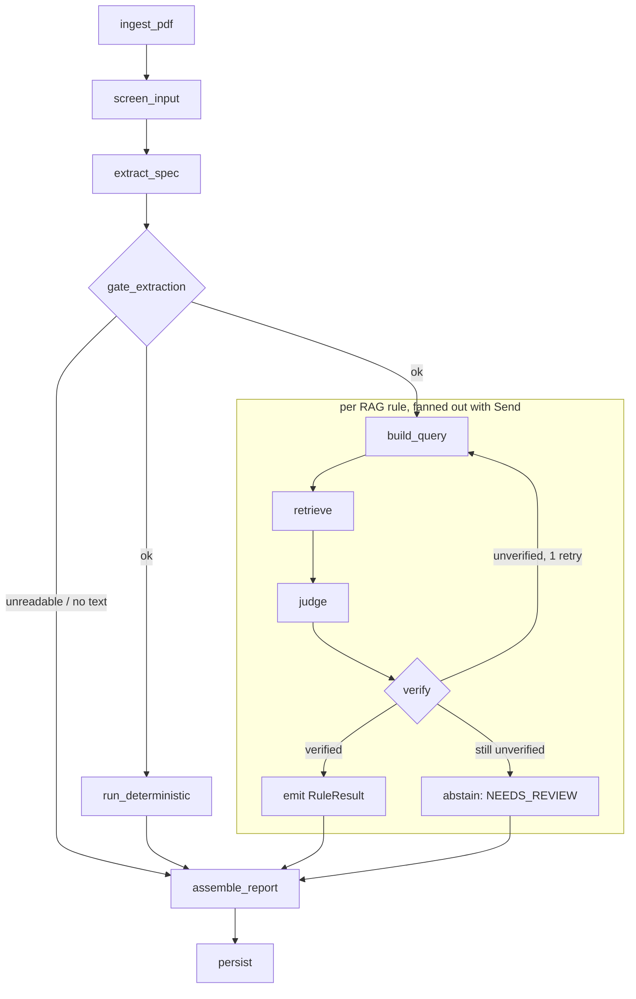

# SpecGuard — rules and graph

Scope for the whole project: eight rules, four of them pure Python. This document is
the contract the rest of the code implements. It is written against the models in
`api/src/specguard/models/`.

## The eight rules

| Rule id | What it checks | Kind | Primary legal anchor |
|---|---|---|---|
| `MANDATORY_FIELDS` | All mandatory particulars are present on the spec: legal name, ingredient list, Annex II allergens, net quantity, date of minimum durability or use-by, storage/conditions of use, FBO name and address, country of origin where required, instructions for use where needed, ABV above 1.2 % vol, nutrition declaration. Conditional particulars are only demanded when their trigger fires. | Deterministic | Reg. (EU) 1169/2011 **Art. 9(1)(a)–(l)** |
| `NUTRITION_ARITHMETIC` | Declared energy is consistent with the declared macronutrients, recomputed from the Annex XIV conversion factors, and kJ is consistent with kcal (1 kcal = 4.184 kJ). Both directions are reported as a percentage delta. | Deterministic | Reg. (EU) 1169/2011 **Annex XIV**, with **Art. 31(3)** requiring energy be calculated using those factors |
| `NUTRITION_PER_100` | The nutrition declaration is expressed per 100 g or per 100 ml. A per-portion declaration is permitted only *in addition*, never instead. | Deterministic | Reg. (EU) 1169/2011 **Art. 32(2)** (additional per-portion: Art. 32(3)–(4)) |
| `ALLERGEN_EMPHASIS` | Every Annex II substance appearing in the ingredient list — including inside compound ingredients — is emphasised in the source markup so it stands out from the rest of the list. | Deterministic | Reg. (EU) 1169/2011 **Art. 21(1)(b)** + **Annex II** |
| `NUTRITION_CLAIM_CONDITIONS` | Each nutrition claim on pack ("source of fibre", "low fat", "reduced sugar") meets the conditions of use for that exact claim, checked against the declared nutrition values. | RAG | Reg. (EC) 1924/2006 **Annex** (conditions of use), gated by **Art. 8(1)** |
| `HEALTH_CLAIM_AUTHORISED` | Each health claim is on the authorised list, is worded within the authorised formulation, and carries the mandatory accompanying statements. | RAG | Reg. (EC) 1924/2006 **Art. 10(1)–(2)**, **Art. 13/14**; authorised wordings from Reg. (EU) 432/2012 Annex |
| `ORIGIN_DECLARATION` | Country of origin or place of provenance is given where its omission would mislead, and where the product's origin is given but its primary ingredient differs, the primary ingredient's origin is declared too. | RAG | Reg. (EU) 1169/2011 **Art. 26(2)(a)**, **Art. 26(3)**; Implementing Reg. (EU) 2018/775 |
| `LEGAL_NAME_AND_QUID` | The legal name is a real legal or customary name carrying any required accompanying particulars, and a QUID percentage is declared wherever an ingredient is named or emphasised on pack. | RAG | Reg. (EU) 1169/2011 **Art. 17** + **Annex VI**; **Art. 22** + **Annex VIII** |

### Why the split falls where it does

The first four are arithmetic, set membership and string presence over a structured
record. They have a single correct answer that a model can only make less reliable and
more expensive, so they never see one (non-negotiable #2). Their citation is a fixed
clause anchor, resolved through `Citation.for_clause()` — deterministic rules still cite,
they just do not retrieve.

The last four need a clause read in context: "does *this* wording meet the conditions of
use", "is origin declaration *required here*". That is a judgement over retrieved text,
and it is where retrieval, a judge and a verification pass earn their cost.

### Tolerances are configuration, not law

`NUTRITION_ARITHMETIC` compares against a configured tolerance (`±5 %` by default). EU
tolerance guidance for nutrition declarations is guidance, not binding text, so the rule
cites Annex XIV and Art. 31(3) for the *method* and reports the delta and the threshold
it used in `RuleResult.metrics`. A reviewer can then disagree with the threshold without
disagreeing with the arithmetic.

## LangGraph node sequence

| # | Node | Does | LLM |
|---|---|---|---|
| 1 | `ingest_pdf` | PDF bytes → per-page text with layout, plus `SourceDocument` (sha256, page count). | no |
| 2 | `screen_input` | Scans document text for imperative/instruction-shaped spans and records them in `GuardrailFlags`. Document text is wrapped and labelled as data from here on and never concatenated into a system prompt (non-negotiable #4). | no |
| 3 | `extract_spec` | One schema-constrained call at temperature 0 producing `ProductSpec`, every field wrapped in `ExtractedField` with its own confidence and `quoted_span`. | yes |
| 4 | `gate_extraction` | Records fields below `MIN_EXTRACTION_CONFIDENCE`. Rules reading a flagged field must abstain rather than fail it. If the document yielded no usable text, short-circuits straight to `assemble_report` with every rule NEEDS_REVIEW. | no |
| 5 | `run_deterministic` | The four Python rules, in-process, no I/O. Emits four `RuleResult`s with fixed-clause citations. | never |
| 6 | `build_query` | Per RAG rule, builds the retrieval query from the spec (the claim text, the primary ingredient, the legal name) with the e5 `query:` prefix. | no |
| 7 | `retrieve` | Qdrant `query_points` with dense + sparse `prefetch` and native RRF fusion. Returns top-k chunks with their deterministic `chunk_id`s. No application-layer fusion. | no |
| 8 | `judge` | Schema-constrained verdict over the retrieved chunks only: verdict, rationale, suggested fix, and the `chunk_id` + `quoted_span` it relied on. | yes |
| 9 | `verify` | Four checks, below. Failure downgrades to NEEDS_REVIEW. | yes (entailment only) |
| 10 | `assemble_report` | Collects results into a `CheckReport` with corpus and graph versions and the guardrail flags. | no |
| 11 | `persist` | Writes job, report and per-rule results to Postgres. Citations are stored by `chunk_id`, which stays resolvable against a re-indexed Qdrant. | no |

Nodes 6–9 run once per RAG rule, fanned out with `Send` and joined at `assemble_report`.
The four deterministic rules run as one node because they are microseconds of pure
computation and fanning them out would buy nothing.

### The verification pass

`judge` proposes; `verify` decides. A judged verdict is only allowed to stand if:

1. the `chunk_id` it cites was actually in the set retrieved for this rule — it cannot
   cite a clause it never saw;
2. `chunk_id == chunk_id_for(regulation, article, paragraph, corpus_version)`, so the
   article it names is the article it retrieved (enforced in `Citation` itself);
3. the `quoted_span` appears verbatim in that chunk's text, whitespace-normalised;
4. a second schema-constrained call answers whether that span *supports* the verdict,
   returning `supports` / `contradicts` / `insufficient`.

Checks 1 to 3 are pure Python and free, so they run first: only a structurally sound
citation is worth paying a model to reason about. Anything other than a clean pass
becomes `NEEDS_REVIEW` with an `AbstentionReason`. This is what non-negotiable #1 looks
like at runtime, and abstention rate is a reported metric, not a defect count.

**A judge may cite up to three clauses.** Real requirements span them: Art. 22(1) says
when a quantitative declaration is required and Annex VIII says how it must be made. A
judge allowed a single citation has to pick, and verification then correctly rejects the
verdict for resting on a clause that establishes half the argument. Verification stops
at the first clause that supports the verdict.

**A rule whose requirement is not triggered returns PASS, not NEEDS_REVIEW**, citing the
provision it enforces as a fixed clause. A product making no health claim complies with
the rules on health claims; calling that an abstention would bury the genuine ones. This
path costs no model calls.

Measured behaviour of this pass is in `docs/decisions.md` 011: it produced no wrong
verdict in 112 evaluations, but PASS verdicts are much harder to cite than FAIL verdicts
and the abstention rate is currently too high.

## What each rule needs from `ProductSpec`

| Rule | Reads |
|---|---|
| `MANDATORY_FIELDS` | every Art. 9 field, plus `alcohol_strength_abv` as the conditional trigger |
| `NUTRITION_ARITHMETIC` | `nutrition.*_g`, `energy_kj`, `energy_kcal` |
| `NUTRITION_PER_100` | `nutrition.basis`, `nutrition.portion_size` |
| `ALLERGEN_EMPHASIS` | `ingredients.raw_text`, `ingredients.items[].emphasised`, `sub_ingredients`, `dominant_emphasis_style` |
| `NUTRITION_CLAIM_CONDITIONS` | `claims[]` where kind is `nutrition`, plus the whole nutrition declaration |
| `HEALTH_CLAIM_AUTHORISED` | `claims[]` where kind is `health` |
| `ORIGIN_DECLARATION` | `origins[]`, `ingredients.items[].percentage` (to identify the primary ingredient), `legal_name` |
| `LEGAL_NAME_AND_QUID` | `legal_name`, `product_name`, `ingredients.items[].percentage` |

The extraction schema exists to serve this table. A field no rule reads should not be in
`ProductSpec`.
